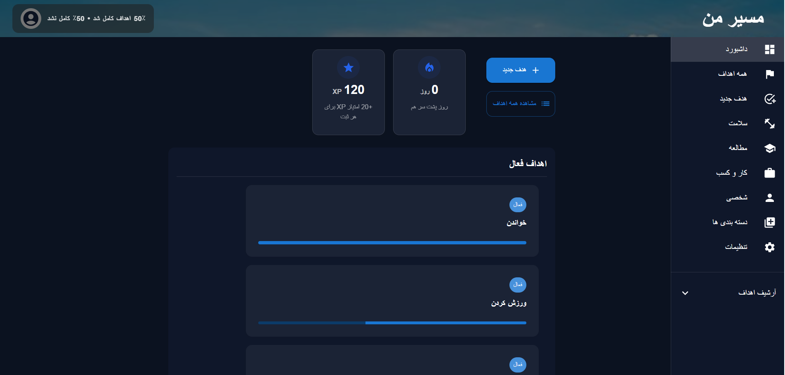

# Goal Tracker Dashboard
A multipage React app that lets users create goals/habits, track progress and view a dashboard , active goals with progress bars, categories, streak, XP, completed goals archive, and responsive layout (desktop + mobile).

## Demo

[](https://youtu.be/FNFCTWWI2ao)

 ## Features Checklist
- Full CRUD: Create, Read, Update, and Delete goals with confirmation dialogs.
- Multi-page Routing: Organized structure using react-router-dom.
- Bilingual Support: English (LTR) and Persian/Arabic (RTL) toggle.
- Gamification: Streak system and XP points tracking.
- Responsive Design: Optimized for Desktop, Tablet, and Mobile.
- Data Persistence: All data is saved to LocalStorage.
- Theme Support: Dark and Light mode (synced with MUI).


##  Language & Direction (RTL/LTR)
- The app uses a custom LanguageContext to manage the UI direction.
- English: Sets the document direction to ltr and uses standard font alignment.
- Persian: Sets the document direction to rtl.
- Implementation: We utilize MUI’s CacheProvider and stylis-plugin-rtl to ensure that layouts (margins, padding, icons) flip automatically when the language is switched in the Settings page.

##  Streak & XP Rules
- To keep users motivated, we implemented the following logic:
- XP System: Users earn +20 XP for every progress log increment.
- Streak System:
  - A streak increases if a goal is updated on consecutive days.
  - If a user misses a full calendar day for a "Daily" goal, the streak resets to 0.
- Auto-Archive: Once a goal reaches 100% progress, it is automatically moved to the Completed Goals archive.

## 👥 Team Contributions


| Member Name | Primary Features & Responsibilities |
| :--- | :--- |
| **Rabia Zia Nezami** | Setup global theme, RTL/LTR Layout logic,  Language handling i18n(fa/en), LocalStorage persistence, implement dark mode with settings page, Create & Edit Goal Page, AuthLayout, AppLayout,  README.md |
| **Fatima Rahmani** |XP/Streak system,  404 page, Category page , Goals Detail Page , Sidebar, Archive page logic & ui, Completed goals logic & preview dashboard|
| **Bahara Rostami** | Goal mangement, Goals List page & Goal card, Display active goal in dashboard, goalList actions, React Router setup, AppLayout, Protected routes, Auth context & useAuth , Dashboard Structure|
| **Fatanah Mawlawizadeh** | React Router setup, Progress calculations, Navbar, Category stats, goal form & Login/register schema, Login/register ,  Protected routes, Langing page |


##  Tech Stack
- Framework: React + Vite
- UI Library: MUI (Material UI)
- Routing: React Router v7
- Icons: MUI Icons
- State Management: React    - Context API / LocalStorage

##  How to Run
1. Clone the repo:
```
git clone [https://github.com/rabianezami/goal-tracker-dashboard.git]
```
Installation
```
npm install
npm run dev
```


